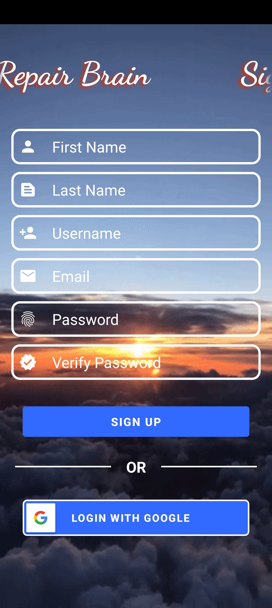
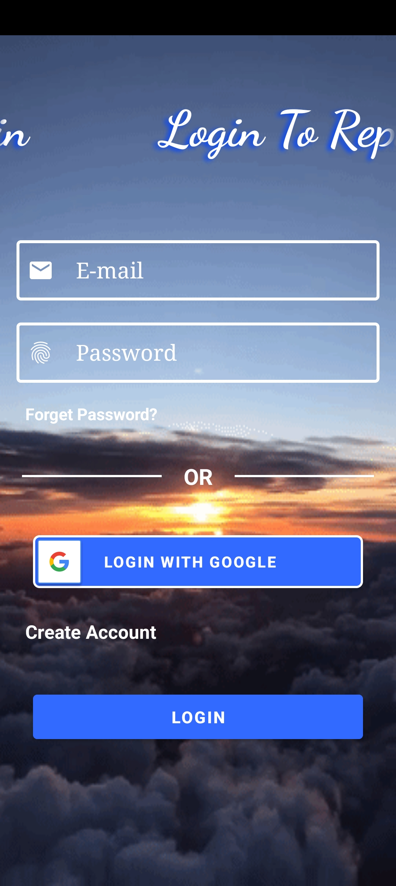
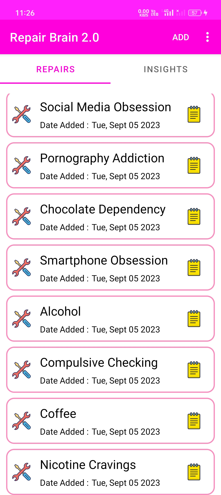
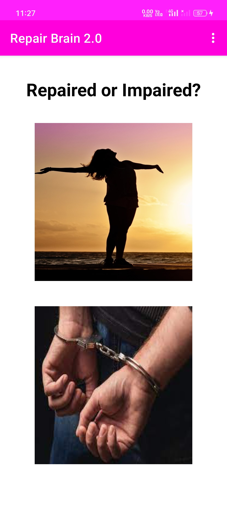
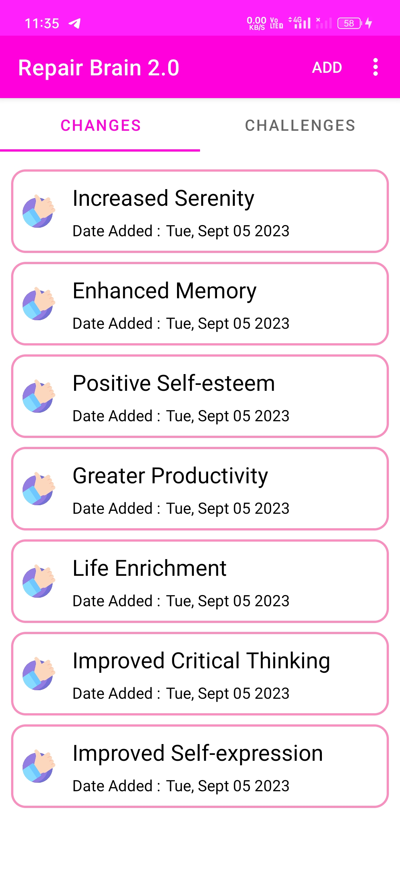
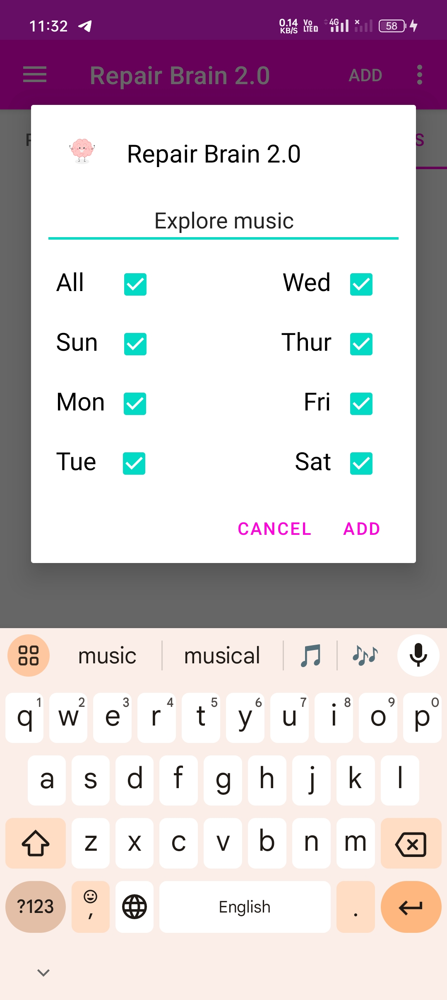
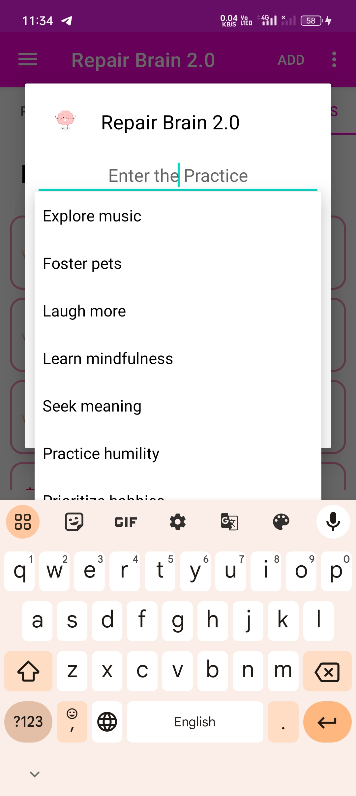
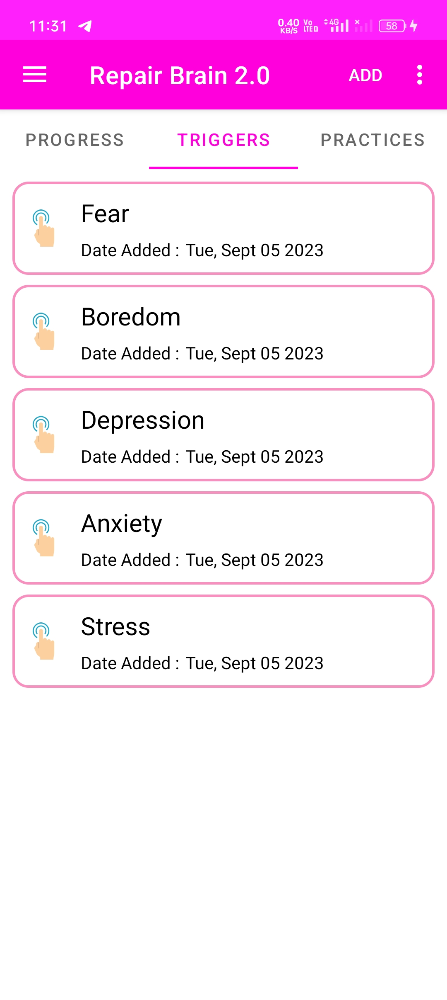
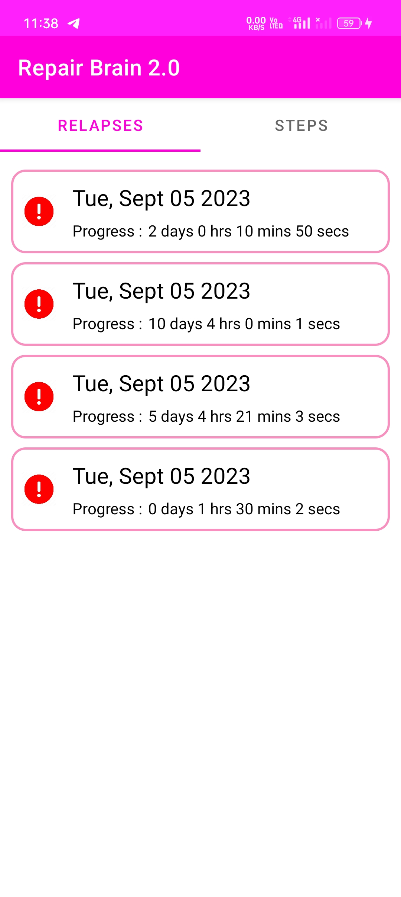

# Repair Brain Android 2.0

    Repair Brain 2.0 is an Android App developed to help people in upgrading themselves in terms of Physical, Mental, Emotional and Spiritual Levels.

# Defnitions 

     Repairs    - Addictions, Compulsions, Delusions or anything which you feel uncomfortable within yourself.
     Insights   - Accurate and Deep Understandings.
     Repaired   - You followed what you want.
     Impaired   - You relapsed in your Journey.
     Progress   - Your Progress.
     Triggers   - Causes of your relapse.
     Practices  - Replace Habits.
     Changes    - Positive changes while you're overcoming your Repair.
     Challenges - Side Effects you're facing in your Journey.
     Relapsed   - You failed once again.
     Steps      - Steps which you took to overcome your Repair.

# Uses
    * Replace addictions, Routines, Delusions or compulsions.
    * Take notes about your repair.
    * Note your understandings and insights along with source and source link.
    * Track your Progress.
        -> Shows Time left to complete one day in your Journey.
        -> Shows Time Gone without Relapse.
        -> Shows Lastly noted Change, Challenge, Next Step and the day which you lastly Relapsed. 
    * Note your Triggers.
    * Add your Practices and Select the days which you want to follow.
    * Note your Changes, Challenges and Steps.
    * View Data of your Relapses.
    * Identify common repairs,triggers,steps etc...

    
# Usage

    1.  Create an Account and Verify your E-mail.

    2.  Login with E-mail or Google.

    3.  Select or enter Repairs.
    4.  Click on the Repair.

    5.  Select whether you Repaired or Impaired yourself.

    6.  Add Insights in the Insights Tab along with source name and source link.

    7.  Similarly Add Changes,Challenges,Steps.

 

    8.  Select or enter practices and check the days which you want to follow it.

    9.  Select or enter your Trigger.

    10. In Relapses Tab, See you Relapses Data.

    11. Click on show common menu to see common repairs, steps, changes etc...

    12. Long click on note icon or Go icon to add or change the source link.

    13. Use Add Common menu to add multiple entries from common lists.

    14. Google Keep link be uses as Note link.

    
# Important Note

    You must find your own way in order to repair your Brain.
    It is just an Idea which can be used or modified before use.

# Future Updates 

    This will be availabe as a web Application next year.

# Special Thanks To

### Database, Authenication and Storage Provider
    Firebase

    
### Authentication Supporters
    Google 
    G-Mail

### Common Source Provider
    ChatGPT 

### Version Control Systems
    GitHub 
    Git 

### IDE Developers
    Android Studio

### OS Developers 
    Fedora.org 
    Android

### Cloud Platform Provider
    Google Colab

### Distributers
    Amazon App Store
    F-Droid
    Aptoide
    Slideme
    AppBrain

# Developer Contact 

[Instagram](https://www.instagram.com/alpha_yr/)

[FaceBook](https://www.facebook.com/yrzfb)

[WhatsApp](https://wa.me/+919047665729)

[G Mail](mailto:seenusanjay20102002@gmail.com)

[GitHub](https://github.com/yrzgithub)

[YouTube](https://www.youtube.com/@yrzwisdom)

[LinkedIn](https://www.linkedin.com/in/seenusanjay/)